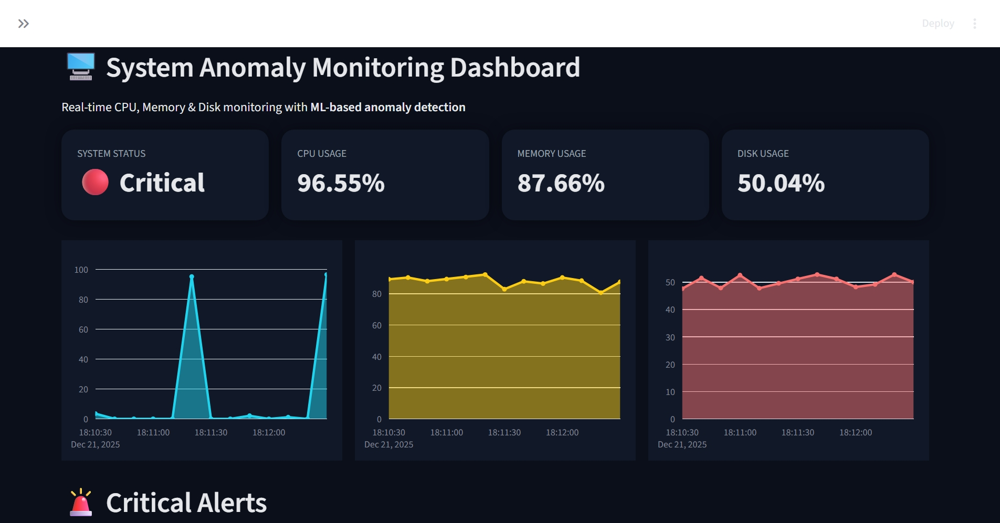

# 🖥️ System Anomaly Monitoring Dashboard

A real-time system monitoring application that tracks CPU, Memory, and Disk usage and detects anomalies using statistical machine learning techniques (Z-score). The system also sends automated email alerts for critical anomalies and provides a professional dashboard for visualization.

---

## 🚀 Features

- Real-time CPU, Memory, and Disk monitoring
- ML-based anomaly detection using Z-score
- Automated Gmail email alerts for critical anomalies
- Alert history tracking
- Dark-themed professional dashboard (Grafana-style)
- REST APIs using FastAPI
- Interactive frontend using Streamlit

---

## 📸 Dashboard Preview




## 🧱 System Architecture

Monitoring Agent → FastAPI Backend →  
Anomaly Detection → Email Alerts + Alert History →  
Streamlit Dashboard

---

## ⚙️ Tech Stack

- **Backend:** FastAPI, Python, psutil
- **Frontend:** Streamlit, Plotly
- **Anomaly Detection:** Statistical ML (Z-score)
- **Alerts:** Gmail SMTP
- **Visualization:** Grafana-style dashboard

---

## ▶️ How to Run the Project

### 1️⃣ Install dependencies
```bash
pip install -r requirements.txt


